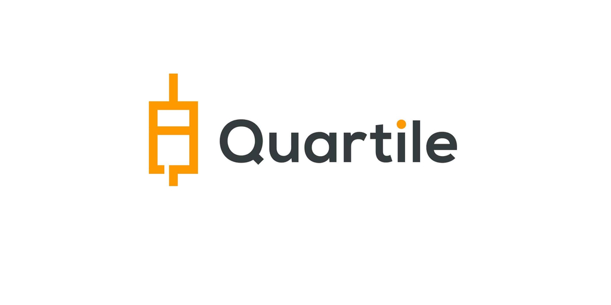

# Quartile API

<p align="center">
  <a href="/"></a>
</p>

Grow your product sales with Quartile’s e-commerce advertising solutions across Amazon, Instacart, and other leading online marketplaces.

[Site Quartile :octicons-link-external-16:](http://www.quartile.com){ .md-button }

---

## **About Documentation**

Welcome to the Quartile API documentation. You'll find tutorials, tips, and extra documentation on using the Developer Portal, tokens, and more.

Our APIs are currently documented using the OpenAPI standard; if you have questions about API endpoints, you can access the Developer Portal and go to the endpoint you want to learn more about.

---

## **Check API Connection**

Change the "**{{sub_key}}**" to your subscriber key. 
If you don't have a subscriber key, you can create one in the Developer Portal.

[Developer Portal :octicons-link-external-16:](https://developer.quartile.com/signin){ .md-button }


=== "v1"
    <div class="termy">

    ```console
    $ curl "https://api.quartile.com/status/v1?subscription-key={{sub_key}}"
    {
        "message": "running"
    }
    ```
    </div>
=== "v2"
    <div class="termy">

    ```console
    $ curl "https://api.quartile.com/status/v2?subscription-key={{sub_key}}"
    {
        "message": "running"
    }
    ```
    </div>
