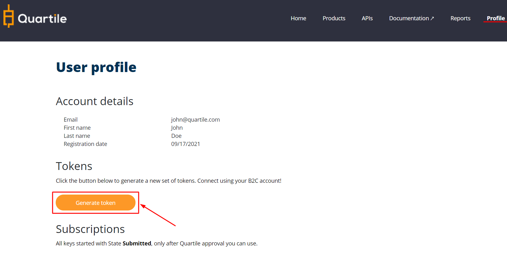
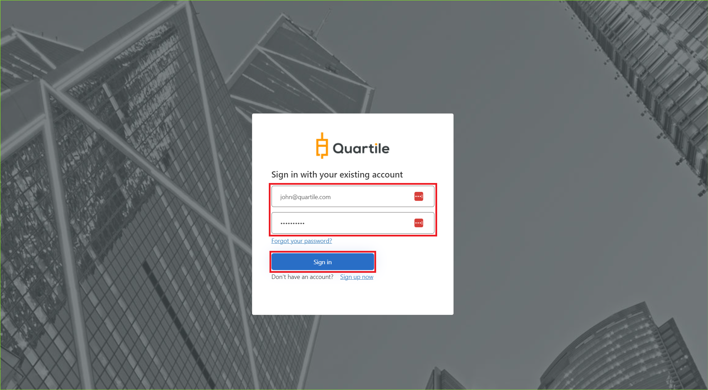

OAuth2 JWT authorization is a secure way to transfer your personal data and validate your identity.

By default you need to create a set of tokens. In this set of tokens, you will receive an authorization token and a refresh token.

* __Authorization Token:__ Use this token to make API request! Send this token in the request header. Token expires in 3600 sec (1 hour) after being created.

* __Refresh Token:__ Use this token to request a new set of tokens. Token expires in 14 days after being created.

!!! warning "Warning :material-refresh: Refresh token"
    When the access token expires and you request a new set of tokens,
    the refresh token will also be updated! **So always save the last refresh token**,
    so you won't have any problems. The refresh token may expire or be disabled when
    you request a new set of tokens!

    You can learn how to deal with this "problem" in the session: [Handling With Refresh Token](/tutorial/auth-dandling-with-refresh-token)

### Step 1. Access Profile

After login, to to the "profile" page. You will see a "Generate Token" button, click this button. You will be redirected to new page where you can generate token.

#### Generate Token



#### Fill in Quartile email and password, click on "sign in".



#### If you have logged in correctly, a set of tokens will be generated.

```JSON
{!../docs/files/token.json!}
```

### Step 2. Endpoints **authorization**, **refresh** and **validate**

Although the "Authorization" url is available, you don't need to use it because you will use the dev portal to generate a new set of tokens. With the generated tokens you can make API calls and request new tokens through the refresh endpoint. 

Access: [OAuth API](https://developer.quartile.com/api-details#api=auth) 


| __Method__ | __Type__ | __URL__ | __Description__ |
| :------------- |:------------- | :------------- | :------------- |
| `GET` | Authorization | :material-close: /auth/v1/token?code={code} | The authorize token, normally the user with a customer profile does not have access to this data. If this is the case, you can obtain new tokens in the Tokens - *Developer Portal > Profile*.  |
| `POST` | Refresh | :material-check: /auth/v1/refresh-token | You need to enter the update token. If you do not have this data, "log in" again on the portal and request a new set of tokens (authorization token and refresh token).|
| `POST` | Validade | :material-check: /auth/v1/validate-token | You can verify that the authorization token is valid.|