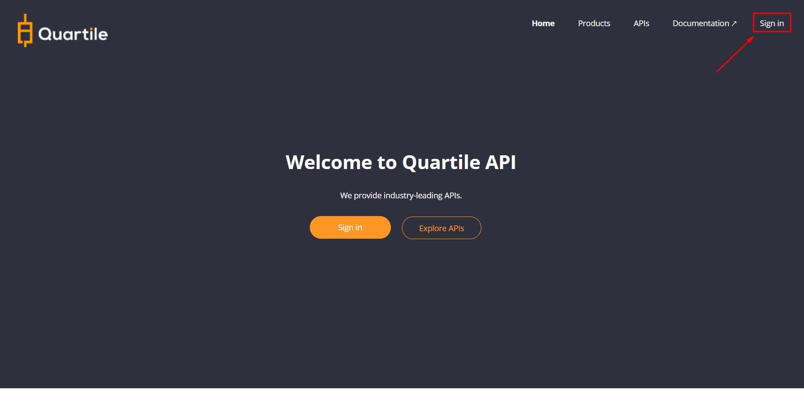
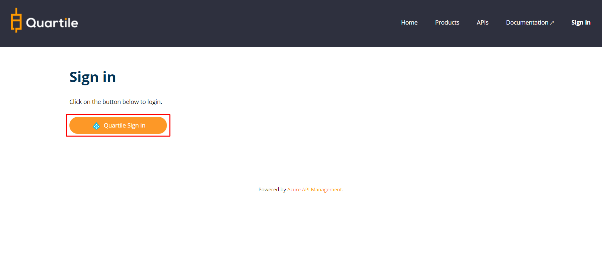
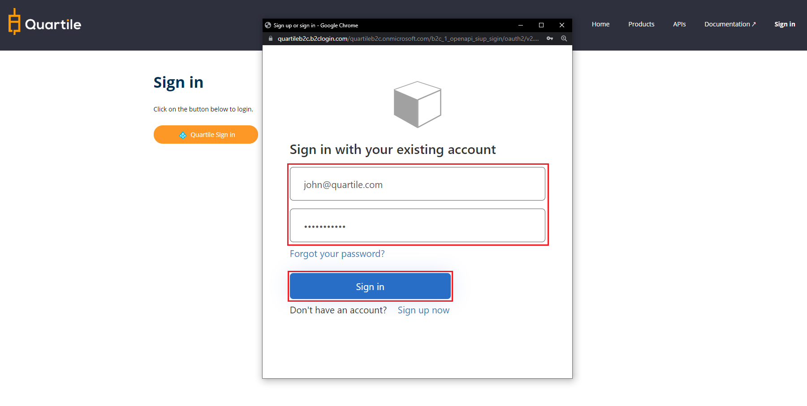
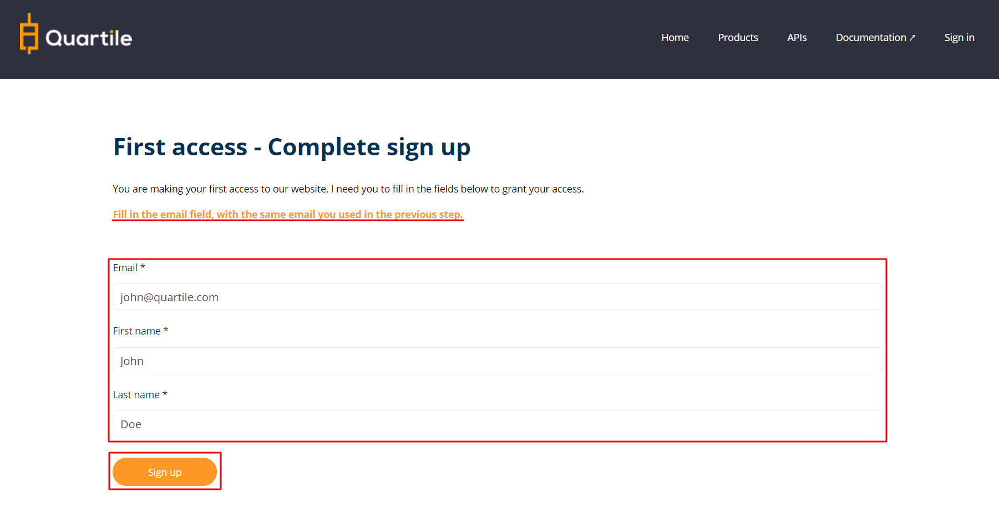

### Step 1 - Access The Developer Portal

<small>* [Click here to access portal:](https://developer.quartile.com){:target="_blank"}</small>

#### Click on "__Sign In__".

#### Login using your Quartile account.

#### Sign in using your email and password registered in the Quartile.

#### Complete the form and click "__Sign Up__".
<small>PS: Fill in the email field, with the same email you used in the previous step.</small>

### Step 2 - Verify subscriber

After registration, it is necessary to validate your subscription. Check your email,
you will receive the confirmation.

