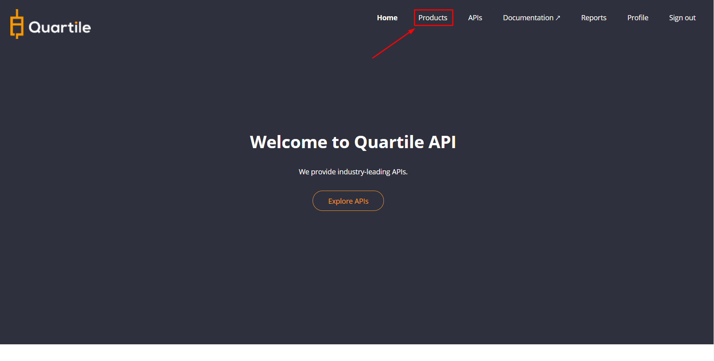
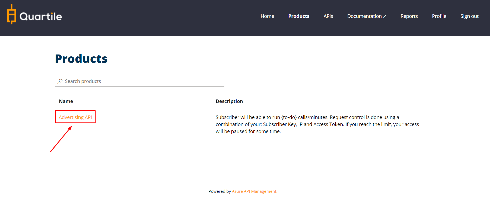
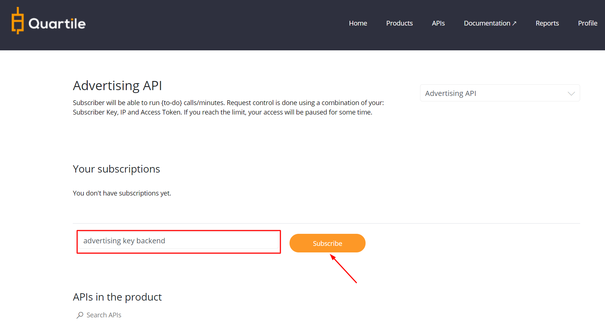
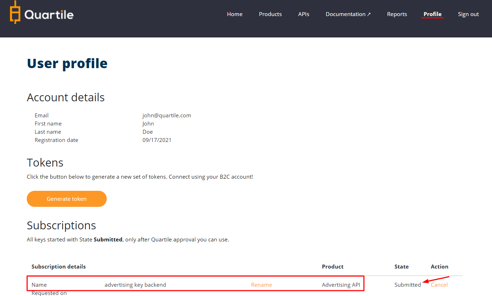

# Create Subscriber

The user can subscribe to any product but cannot have more than one active key for each product.
All keys must be approved (activated by Quartile), activation deadline is 24 hours after creation.

---
## **Subscribe to a product**

### **Access the products page**

Go to **Products** by clicking on the menu. 

### **Click on a product**

All products will be listed; you can click on a product, for example, Advertising API.

### **Subscribe to the product**

Fill in the field with the name you want to call the key and click **Sign Up**!

---
## **Check Your Keys**

Access **Profile**. Verify that your key was created. All keys starting with **State** Submitted; only after Quartile's approval will you be able to use them.

