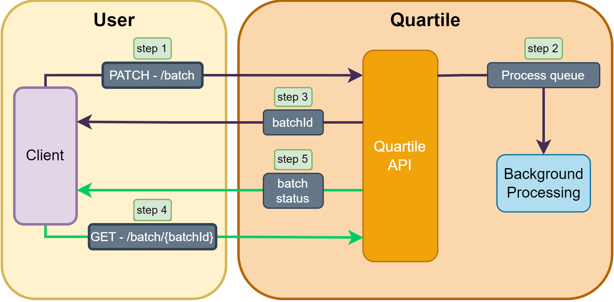

Batch processing is a way to process multiple `resources` in a single request. This is useful when you need to process a lot of `resources`; instead of submitting multiple requests, you can send in batches of up to 100 `resources` at a time.


!!! note
    Batch processing is only available for some resources. See the [v2 - Changes](/changes-v1-to-v2.html) for more information.
---

## **Batch processing overview**
Some resources have batch processing endpoints.

The batch processing endpoint is `/batch`. It accepts a `PATCH` request with a JSON body containing an array of `resources` to be processed. Each `resource` is a JSON object.
After the request is submitted, the response will contain a `batchId` that can be used to retrieve the results of the batch processing.
Use the endpoint `/batch/{batchId}` to retrieve the results of the batch processing.

**Diagram of batch processing**

<figure markdown>
  { width="100%" }
  <figcaption>Batch processing diagram</figcaption>
</figure>

---

## **Batch processing request**

This request is an example of a batch processing request for the `masterlist` resource.
### **PATCH**


#### **Request**

```http
PATCH /amazon/v2/process/masterlist HTTP/1.1
Host: api.quartile.com
Content-Type: application/json
Subscription-Key: <subscription_key>
Authorization: Bearer <access_token>

[
    {   
        "asin": "ASINXYZXPTO1", 
        "countryCode": "US", 
        "percACoS": 2.7
    }
]
```

#### **Response**

```http
HTTP/1.1 200 OK
Content-Type: application/json

{
    "batchId": "5349b4ddd2781d08c09890f3"
}
```

### **GET**

Returns the status of a batch process.
The batch process is asynchronous, so it may take a while to complete.

The status_code and status can be:

- `206-PENDING`: the batch is in the queue waiting to be processed.
- `206-RUNNING`: the batch is being processed.
- `206-PARTIAL`: the batch has been processed partially.
- `206-FAILED`: the batch has failed to be processed completely.
- `200-SUCCESS`: the batch has been processed successfully.

After the batch is processed, the response will contain a list of objects.
The list with the status per item will be returned when the processing status is FAILED, SUCCESS, or PARTIAL.

#### **Request**

```http
GET /amazon/v2/batch/{batchId} HTTP/1.1
Host: api.quartile.com
Content-Type: application/json
Subscription-Key: <subscription_key>
Authorization: Bearer <access_token>
```

#### **Response**

##### **Example: 200-Status Code**

```http
HTTP/1.1 200 OK
Content-Type: application/json

{
    "batchId": "5349b4ddd2781d08c09890f3",
    "status": "SUCCESS",
    "data": [
        {
            "id": "497f6eca-6276-4993-bfeb-53cbbbba6f08",
            "asin": "ASINXYZXPTO1", 
            "countryCode": "US", 
            "percACoS": 2.7
            "status": {
                "success": true,
                "message": "successfully",
                "process": "INSERT"
            }
        }
    ]
}

```

##### **Example: 206-Status Code**

```http
HTTP/1.1 206 Partial Content
Content-Type: application/json

{
  "detail": "processing",
  "status": "PENDING"
}
```
