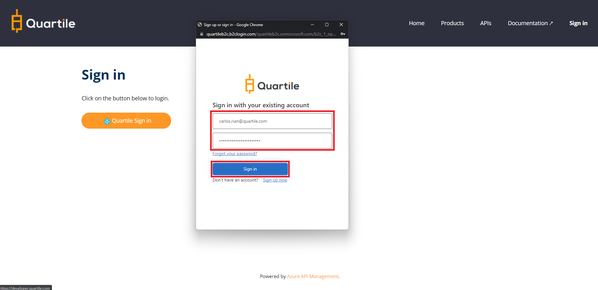
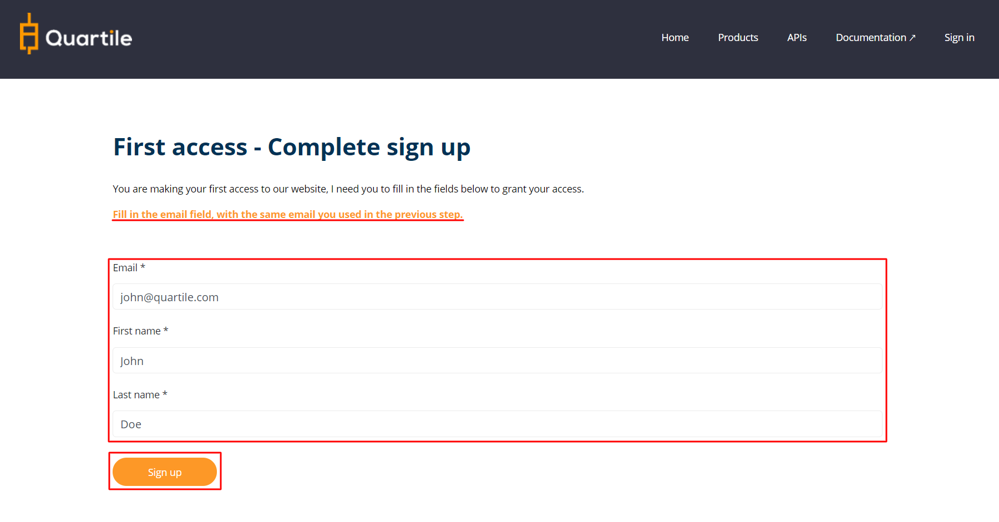

# First Access

The first access to the Quartile Developer Portal is done through the Quartile account, the same used to access the [**Quartile Portal**](https://app.quartile.com/). 

---

## **Create a developer account**

Access the [**Quartile Developer Portal**](https://developer.quartile.com)

**Use the same email and password used to access the [Quartile Portal](https://app.quartile.com/)**.

### **Click on "Sign In"**.

### **Login**

Make the login using your Quartile account.

### **Sign in**

Make the sign-in using your email and password registered in the Quartile.

### **Complete the form**

Fill in the email field with the email you used in the **previous step**.

After filling in the data, click the **"Sign Up"** button.

---
## **Verify subscriber**

After registration, it is necessary to validate your subscription. Check your email; you will receive the confirmation.